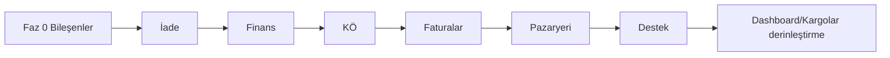

# Kargom Kapında Portal — Stocado Parite TODO Listesi

**Kaynak inceleme:** [`STOCADO_PORTAL_FULL_AUDIT.md`](./STOCADO_PORTAL_FULL_AUDIT.md)  
**Canlı referans:** https://portal.stocado.com/  
**Son güncelleme:** 4 Haziran 2026

Bu dosya, audit raporundaki her sayfa için uygulanabilir görevleri öncelik sırasıyla listeler. Durum sütununda: `⬜` yapılmadı, `🟡` kısmi, `✅` tamam.

---

## Özet

| Metrik | Değer |
|--------|--------|
| Placeholder sayfa (Kargom Kapında) | **9** |
| Kısmi / iskelet sayfa | **7** |
| Hedef: P0 tamamlanınca “boş taslak” algısı | ~%70 azalır |

**Kısıtlar (ürün):**

- Giriş sayfası (`/auth/login`) Stocado ile bire bir yapılmayacak — Kargom Kapında split layout korunur.
- API katmanı: PostgREST + RPC (`portal/src/api/rpc.ts`).
- Marka: **Kargom Kapında** (Stocado adı UI’da yok).

---

## Faz 0 — Altyapı ve ortak bileşenler

Audit §Ek ve tüm liste sayfaları için ön koşul.

| # | Görev | Dosya / not | Durum |
|---|--------|-------------|--------|
| 0.1 | `FinanceBadges` — turuncu Bakiye, mavi K.Ö (header) | `AccountFinanceBadges`, `AppLayout` | 🟡 |
| 0.2 | `QueryDataTable` — sıralama, sayfalama, kolon görünürlüğü | `portal/src/components/` | ⬜ |
| 0.3 | `FilterDrawer` + üstte filtre chip’leri | Ortak; Kargolar/Finans/Pazaryeri | ⬜ |
| 0.4 | `KpiStrip` / `KpiCard` (gradient veya bordered) | İade, KÖ dashboard, Faturalar | ⬜ |
| 0.5 | `PageHeader` — başlık + sağ aksiyonlar | Tüm sayfalar | ⬜ |
| 0.6 | `StatusBadge` — kargo / ödeme / fatura durumları | Tema `theme.ts` ile uyumlu | ⬜ |
| 0.7 | `EmptyState` — illüstrasyon + CTA | Placeholder yerine | ⬜ |
| 0.8 | `PeriodSelect` — 7/14/30 gün, 1/3/6/12 ay | Dashboard, istatistik, KÖ | ⬜ |
| 0.9 | Migration **014** + **015** tüm ortamlarda uygula | `db/migrations/` | ⬜ |
| 0.10 | `portal/scripts/smoke-api.mjs` — tüm kritik RPC | CI / manuel | 🟡 |

---

## Faz 1 — P0: Placeholder → gerçek sayfa (9 rota)

`portal/src/routes/index.tsx` içinde hâlâ `PlaceholderPage` olan rotalar.

### 1.1 İade yönetimi (`/returns`)

**Audit:** §6

| # | Görev | RPC / DB | Durum |
|---|--------|----------|--------|
| 1.1.1 | `ReturnsPage` — KPI şeridi (4 kart) + iade oranı rozeti | `account_returns_summary` (yeni) | ⬜ |
| 1.1.2 | Sekmeler: Tümü \| Bekleyen \| Yolda \| Teslim \| İptal | `account_returns_query` | ⬜ |
| 1.1.3 | Tablo kolonları (referans, barkod, alıcı, sebep, son hareket…) | Audit §6 | ⬜ |
| 1.1.4 | Bilgi `Alert` — Kargolar ⋮ → İade talebi | Statik + link | ⬜ |
| 1.1.5 | İade oluşturma modalı (önceden tanımlı sebepler + Diğer) | `cargo_create_return` | ⬜ |
| 1.1.6 | Kargolar satır menüsünden “İade talebi oluştur” | `CargosPage` | ⬜ |
| 1.1.7 | Route: `PlaceholderPage` → `ReturnsPage` | `routes/index.tsx` | ⬜ |

### 1.2 Finans hareketlerim (`/accounting-transactions`)

**Audit:** §9

| # | Görev | RPC / DB | Durum |
|---|--------|----------|--------|
| 1.2.1 | `AccountingTransactionsPage` | — | ⬜ |
| 1.2.2 | Sekmeler: Tümü \| Kapıda Ödemeler \| İşlem Türleri | `account_ledger_query` | ⬜ |
| 1.2.3 | Tablo: ID, cari, belge, işlem türü, tutar (±), bakiye, referans… | Seed işlem türleri | ⬜ |
| 1.2.4 | Filtre drawer + chip + export ikonları | Ortak 0.3 | ⬜ |
| 1.2.5 | (Opsiyonel P1) Manuel işlem / transfer — admin rolü | Ayrı RPC | ⬜ |

### 1.3 Kapıda ödeme (`/pay-on-delivery/*`)

**Audit:** §10

| # | Görev | RPC / DB | Durum |
|---|--------|----------|--------|
| 1.3.1 | Nested route: `dashboard`, `upcoming`, `tracking`, `paid`, `cargos`, `banks` | `routes/index.tsx` | ⬜ |
| 1.3.2 | Gösterge paneli: KPI, ödeme akışı, grafik, zaman çizelgesi | `account_pod_dashboard` | ⬜ |
| 1.3.3 | Yaklaşan ödemeler — mahsup takvimi | `account_pod_upcoming` | ⬜ |
| 1.3.4 | Ödeme takibi — dönem + durum + arama | `account_pod_tracking_query` | ⬜ |
| 1.3.5 | Ödenenler listesi | `account_pod_paid_query` | ⬜ |
| 1.3.6 | Kargolar (POD tablosu) | `account_cargos_query` + `pod_only` | ⬜ |
| 1.3.7 | Banka hesapları CRUD | `account_pod_banks` | ⬜ |
| 1.3.8 | Menüde `can_pod` ile gizle/göster | `menu.ts` + hesap yetkileri | ⬜ |

### 1.4 Faturalarım kümesi

**Audit:** §11–12

| # | Görev | Sayfa | Durum |
|---|--------|-------|--------|
| 1.4.1 | `InvoicesPage` — yıl seçici, arama, toplam kart, PDF listesi | `/invoices` | ⬜ |
| 1.4.2 | `InvoicesPendingPage` — Sovos uyarısı, segment, toplu/tekli kes | `/invoices/pending` | ⬜ |
| 1.4.3 | `InvoicesIssuedPage` — dönem, KPI, Sovos durumları | `/invoices/issued` | ⬜ |
| 1.4.4 | `InvoicesExternalPage` — Excel + harici liste | `/invoices/external` | ⬜ |
| 1.4.5 | `InvoiceSettingsPage` — Sovos, banka, VKN, varsayılan not | `/settings/invoice-settings` | ⬜ |
| 1.4.6 | RPC: `customer_invoices_*`, `pending_cargos`, `issue_invoice` | `db/migrations/016_invoices.sql` (plan) | ⬜ |
| 1.4.7 | Menü `can_invoice` alt menüleri | `menu.ts` | ⬜ |

### 1.5 Pazaryeri siparişleri (`/market-orders`)

**Audit:** §13

| # | Görev | Durum |
|---|--------|--------|
| 1.5.1 | `MarketOrdersPage` — KPI chip şeridi (7 durum) | ⬜ |
| 1.5.2 | Araç çubuğu: yenile, Excel, kolon yöneticisi (localStorage) | ⬜ |
| 1.5.3 | Toplu: kargo oluştur, iptal, geçmiş/yorum çekme (P2 API) | ⬜ |
| 1.5.4 | `account_market_orders_query` + seed siparişler | ⬜ |
| 1.5.5 | Pazaryeri logosu kolonu | ⬜ |

### 1.6 Destek merkezi (`/tickets`)

**Audit:** §16

| # | Görev | Durum |
|---|--------|--------|
| 1.6.1 | `TicketsPage` — Tümü \| Bekleyenler, tablo | ⬜ |
| 1.6.2 | Yeni talep formu: Konu*, Öncelik, Mesaj* | ⬜ |
| 1.6.3 | Detay sayfası + mesaj thread’i | ⬜ |
| 1.6.4 | Sidebar okunmamış badge — `tickets_unread_count` | ⬜ |

### 1.7 Alt hesaplar (`/sub-accounts`)

**Audit:** §18

| # | Görev | Durum |
|---|--------|--------|
| 1.7.1 | `SubAccountsPage` — liste, oluştur, yetki | ⬜ |
| 1.7.2 | Menü: `has_sub_accounts` | ⬜ |

---

## Faz 2 — P1: Mevcut sayfaları derinleştir (iskelet → Stocado derinliği)

### 2.1 Gösterge paneli

**Audit:** §3 | Kargom Kapında: 🟡

- [ ] Sekmeler **Kapıda Ödemeler** ve **Finans** — gerçek widget içeriği
- [ ] Türkiye haritası (şehir yoğunluğu) veya basitleştirilmiş heatmap
- [ ] Alt sekmeler: Sorunlu \| Desi değişmeleri
- [ ] `GET dashboard/metrics` — 6 KPI kartı Stocado renkleriyle eşleşsin
- [ ] Dönem menüsü 7/14/30 gün (`PeriodSelect`)

### 2.2 Kargolarım

**Audit:** §5 | Kargom Kapında: 🟡

- [ ] 24 kolon tam seti + taşıyıcı logo
- [ ] Kapıda ödemeli / Taslaklar sekmeleri — ayrı kolon setleri
- [ ] 13+ filtre grubu drawer + chip
- [ ] Satır ⋮ menü: detay, iptal, etiket, iade talebi
- [ ] Export / kolon yöneticisi / sayfa boyutu 10-25-50
- [ ] `account_cargos_query` — tüm `fields` ve `filters` eşlemesi

### 2.3 Yeni kargo

**Audit:** §4 | Kargom Kapında: 🟡

- [ ] Adres defteri modal (+ yeni adres)
- [ ] Ürün seç modal (`products` API)
- [ ] Canlı teklif: `account_cargo_quote` + sağ panel **Tekliflerim**
- [ ] **Kargo Bana Gelsin** akışı (P2)
- [ ] Taslak kaydet / Temizle

### 2.4 Ürünlerim

**Audit:** §7

- [ ] Yeni ürün / düzenle modal
- [ ] `account_products_crud` RPC
- [ ] Excel indir / özel sekme ekleme (P2)
- [ ] Aktif toggle + sil onayı

### 2.5 Fiyat listesi

**Audit:** §8

- [ ] Taşıyıcı sekmeleri — gerçek plan verisi (`pricing_plans` tablosu)
- [ ] Normal \| Ek ücretler alt sekmeleri
- [ ] Sağ panel: artan desi, limit aşımları
- [ ] Mavi bilgi kutusu (sabit metin + i18n)

### 2.6 Entegrasyonlar

**Audit:** §14

- [ ] Sekmeler: Fatura \| API (içerik)
- [ ] **Bağlan** sihirbazı (OAuth / API key — mock veya gerçek)
- [ ] Bağlı durumu kart üzerinde

### 2.7 İstatistikler

**Audit:** §15

- [ ] Performans \| Finansal \| Hedefler & Trend sekmeleri — grafik + tablo
- [ ] Sarı akıllı uyarılar bandı
- [ ] Haftalık bar chart, dönem karşılaştırma tablosu
- [ ] `account_statistics_*` RPC

### 2.8 Ayarlar

**Audit:** §17 | Kargom Kapında: çoğu “yakında”

| Sekme | Görev | Durum |
|--------|--------|--------|
| Belge Yükle | Liste + durum rozetleri | ⬜ |
| Hesap Bilgileri | Unvan, vergi, adres formları | ⬜ |
| Kullanıcılar | CRUD | ⬜ |
| Adresler | Adres defteri (kargo ile paylaşım) | 🟡 |
| Etiket | `label_settings` RPC UI | 🟡 |
| Giriş Geçmişi | Oturum logları | ⬜ |
| E-posta Bildirimleri | Tercih checkbox’ları | ⬜ |
| Fatura Ayarları | → ayrı rota veya sekme birleşimi | ⬜ |
| Kargo Firma Ayarları | Taşıyıcı tercihleri | ⬜ |
| Hesap bloğu | Logo, yetki checkbox, limitler | ⬜ |

---

## Faz 3 — P2: Kimlik, menü, i18n, kalite

### 3.1 Auth (login hariç)

- [ ] Kayıt — EK-1/EK-2, KVKK onay kutuları (audit §2.2)
- [ ] Şifremi unuttum — e-posta + API
- [ ] Beni hatırla / oturum süresi

### 3.2 Menü ve yetkiler

- [ ] `can_pod`, `can_invoice`, `has_sub_accounts` — backend’den hesap JSON
- [ ] Destek okunmamış sayısı — canlı poll veya React Query

### 3.3 i18n

- [ ] TR/EN — yeni sayfa metinleri `locales/*.json`
- [ ] Para birimi ve tarih formatı `tr-TR`

### 3.4 Test ve CI

- [ ] Vitest: kritik sayfa smoke (tablo render, boş durum)
- [ ] E2E (opsiyonel): login → kargo listesi → yeni kargo
- [ ] Lint/typecheck PR gate

---

## Faz 4 — P3: Piksel parite ve entegrasyon gerçekleri

- [ ] Sidebar aktif stil: `#e6f4ff` + sol 3px mavi (audit §1)
- [ ] Tablo header `#f9fafb`, border `#e5e7eb`
- [ ] Inter / 13–14px tipografi tutarlılığı
- [ ] Gerçek pazaryeri OAuth (Trendyol, HB, …) — ayrı proje fazı
- [ ] Sovos e-fatura prod entegrasyonu

---

## Sayfa → dosya eşlemesi (hedef)

| Rota | Bileşen (hedef) | Mevcut |
|------|-----------------|--------|
| `dashboard` | `DashboardPage` | ✅ var, derinleştir |
| `cargos/create` | `CreateCargoPage` | ✅ |
| `cargos` | `CargosPage` | ✅ |
| `returns` | `ReturnsPage` | ❌ Placeholder |
| `products` | `ProductsPage` | ✅ kısmi |
| `pricing-plans` | `PricingPlansPage` | ✅ kısmi |
| `accounting-transactions` | `AccountingTransactionsPage` | ❌ |
| `pay-on-delivery/*` | `PayOnDelivery/*` | ❌ |
| `invoices` | `invoices/InvoicesPage` | ❌ |
| `invoices/pending` | `invoices/PendingPage` | ❌ |
| `invoices/issued` | `invoices/IssuedPage` | ❌ |
| `invoices/external` | `invoices/ExternalPage` | ❌ |
| `settings/invoice-settings` | `invoices/InvoiceSettingsPage` | ❌ |
| `market-orders` | `MarketOrdersPage` | ❌ |
| `integrations` | `IntegrationsPage` | ✅ kısmi |
| `statistics` | `StatisticsPage` | ✅ kısmi |
| `tickets` | `TicketsPage` | ❌ |
| `settings` | `SettingsPage` | ✅ kısmi |
| `sub-accounts` | `SubAccountsPage` | ❌ |

---

## Önerilen uygulama sırası (tek sprint görünümü)

1. **Faz 0** (0.2–0.8) — 2–3 gün eşdeğer iş  
2. **1.1 İade** + **1.2 Finans** — en görünür “boş sayfa” kazanımı  
3. **1.3 KÖ** — çok sekmeli, en büyük iş paketi  
4. **1.4 Faturalar** — DB + Sovos mock  
5. **1.5 Pazaryeri** + **1.6 Destek** + **1.7 Alt hesaplar**  
6. **Faz 2** — mevcut sayfaları Stocado ★★★ seviyesine  

---

## İlerleme takibi

| Faz | Toplam görev (yaklaşık) | Tamamlanan | Not |
|-----|-------------------------|------------|-----|
| 0 | 10 | 2 | FinanceBadges, smoke kısmi |
| 1 | ~45 | 0 | 9 placeholder |
| 2 | ~35 | ~8 | Kısmi sayfalar |
| 3 | ~10 | 0 | |
| 4 | ~5 | 0 | |

**PR hedefi:** Her P0 sayfa için ayrı dal mümkün (`cursor/returns-page-90ab`, …) veya tek `cursor/stocado-parity-ui-90ab` üzerinde sıralı commit.

---

*Audit detayı için her görevde ilgili bölüm numarasına bakın: [`STOCADO_PORTAL_FULL_AUDIT.md`](./STOCADO_PORTAL_FULL_AUDIT.md).*
